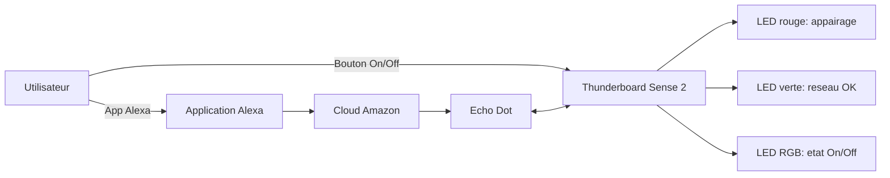

# TP Logiciels Embarques - Zigbee

> Sujet 1: On/Off Light
> Auteurs: Baptistin PILET, Theophile AVENEL
> Date: 15 janvier 2026
> Statut: Sujet 1 realise, Sujet 2 non realise

## Resume

- Objectif: creer une lampe Zigbee On/Off, pilotable localement et via Alexa.
- Carte: Thunderboard Sense 2 (Silicon Labs).
- Controle: bouton local + application Alexa (Echo Dot coordinateur).
- Etat: LED RGB pour l etat On/Off, LED rouge pour appairage, LED verte pour connexion.

## Depot

- https://github.com/thekester/gecko_sdk_tp

## Materiel et outils

- Thunderboard Sense 2 (end device Zigbee).
- Amazon Echo Dot (coordinateur Zigbee + passerelle Alexa).
- Simplicity Studio 5.
- Gecko SDK 4.5.0.
- ZAP (ZCL Advanced Platform).
- Tera Term (logs serie).

## Architecture

## Sujet 1 : Creer un objet Type On/Off Light

### Configuration Zigbee

- Device: HA On/Off Light (profile ID = 0x0104).
- Outil: ZAP pour configurer le endpoint 1, ajouter les clusters manquants et activer les attributs du cluster Basic.

### Trace serie

Nous avons utilise Tera Term pour suivre l appairage Zigbee et diagnostiquer les problemes.
Exemple utile: "NWK Steering stack status 0x9D" signifie "EMBER_NETWORK_CLOSED", donc fenetre d appairage fermee.
Ces traces aident a comprendre pourquoi une LED reste rouge apres emberAfPluginNetworkSteeringStart.

### Boutons

- B1: commissioning (join/leave).
- B2: bascule locale On/Off.
- Callback: `sl_button_on_change` avec filtrage appui / relache.

### LEDs simples

- LED rouge: appairage en cours.
- LED verte: connexion Zigbee active.

### LED RGB et GPIO

Les LEDs RGB demandent une config supplementaire via le Pin Tool et `GPIO_PinModeSet`:

- `RGB_LED_ENABLE` pour l alimentation.
- `LED_COM_X` pour selectionner la LED.
- `PD11`, `PD12`, `PD13` pour les composantes couleur.

### Decouplage (contexte Zigbee)

La callback bouton s execute en interruption, donc pas d appel direct a la stack Zigbee.
Nous avons decouple via `sl_zigbee_event`:

- init avec `sl_zigbee_af_isr_event_init`
- activation avec `sl_zigbee_event_set_active`

### Stack Zigbee (APIs principales)

- Join: `emberAfPluginNetworkSteeringStart`
- Fin join: `emberAfPluginNetworkSteeringCompleteCallback`
- Etat au boot: `emberAfStackStatusCallback`
- Leave: `emberLeaveNetwork`
- Changement d attribut: `emberAfPostAttributeChangeCallback`
- Lecture/criture attribut: `emberAfReadServerAttribute`, `emberAfWriteServerAttribute`

## Cahier des charges (Sujet 1)

### 1. Contexte et objectif

Le client souhaite un objet domotique de type lampe connectee, controlable via Amazon Alexa et integrable a un reseau Zigbee. Le produit doit permettre le On/Off local et distant, avec une synchronisation fiable de l etat.

### 2. Perimetre du produit

**Inclus**
- Commande On/Off locale (bouton).
- Commande On/Off distante (Alexa via Echo Dot).
- Affichage local de l etat (LED RGB).
- Commissioning (join/leave).
- Indication d etat reseau (LEDs).

**Exclus**
- Dimming ou gestion de couleur avancee.
- Fonctions capteurs non liees au On/Off.

### 3. Environnement et interfaces

| Element | Role | Interface principale |
| --- | --- | --- |
| Utilisateur | Declenche les actions On/Off | Boutons, application Alexa |
| Thunderboard Sense 2 | Execute On/Off et publie l etat | Zigbee, LEDs, boutons |
| Echo Dot | Coordinateur Zigbee, passerelle Alexa | Zigbee, cloud Amazon |
| Application Alexa | Commande et visualisation | Cloud Amazon |

### 4. Schema de l objet et de son environnement

- Utilisateur <-> Boutons / Application Alexa
- Thunderboard Sense 2 (Zigbee end device)
- Echo Dot (coordinateur)
- Cloud Amazon

### 5. Exigences

| ID | Categorie | Exigence |
| --- | --- | --- |
| EXG-F01 | Fonctionnelle | Commande On/Off locale via bouton. |
| EXG-F02 | Fonctionnelle | Commande On/Off distante via Alexa. |
| EXG-F03 | Fonctionnelle | Affichage On/Off dans Alexa. |
| EXG-F04 | Fonctionnelle | Synchronisation Alexa apres changement local. |
| EXG-Z01 | Zigbee | Rejoindre un reseau si non connecte. |
| EXG-Z02 | Zigbee | Quitter le reseau si connecte. |
| EXG-Z03 | Zigbee | Device HA type On/Off Light. |
| EXG-I01 | IHM locale | LED rouge pendant appairage. |
| EXG-I02 | IHM locale | LED verte si reseau OK. |
| EXG-I03 | IHM locale | LED RGB refl ete l etat On/Off. |
| EXG-L01 | Logiciel | Reagir aux changements d attribut Zigbee. |
| EXG-L02 | Logiciel | Mettre a jour l attribut Zigbee apres action locale. |
| EXG-L03 | Logiciel | Appels Zigbee via mecanisme d evenements. |

## Plan de validation (tests)

Test 001 - Bascule locale On/Off

- Exigences: EXG-F01, EXG-I03, EXG-L02
- Etat initial: objet connecte, LED RGB dans un etat connu.
- Actions: appuyer 2 fois sur B2.
- Attendu: la LED RGB bascule puis revient a l etat initial.

Test 002 - Mise a jour Alexa apres action locale

- Exigences: EXG-F03, EXG-F04, EXG-L02
- Etat initial: objet appaire, etat connu dans Alexa.
- Actions: appuyer sur B2.
- Attendu: LED RGB change, Alexa se met a jour.

Test 003 - Commande distante Alexa

- Exigences: EXG-F02, EXG-I03, EXG-L01
- Etat initial: objet appaire.
- Actions: envoyer On puis Off via Alexa.
- Attendu: LED RGB suit chaque commande.

Test 004 - Commissioning join

- Exigences: EXG-Z01, EXG-I01, EXG-I02
- Etat initial: non connecte.
- Actions: appuyer sur B1 pour join.
- Attendu: LED rouge active pendant join, LED verte ON a la fin.

Test 005 - Commissioning leave

- Exigences: EXG-Z02, EXG-I02
- Etat initial: connecte.
- Actions: appuyer sur B1 pour leave.
- Attendu: objet quitte le reseau, LED verte OFF.

Test 006 - Type d appareil expose

- Exigences: EXG-Z03
- Etat initial: objet appaire.
- Actions: verifier la fiche appareil dans Alexa.
- Attendu: type On/Off Light, pas de fonctions incoherentes.

Test 007 - Contexte Zigbee via evenement

- Exigences: EXG-L03
- Etat initial: logs actifs.
- Actions: appui B2 puis commande Alexa.
- Attendu: logs montrent un event avant l appel Zigbee.

Test 008 - Bascules locales rapides

- Exigences: EXG-F01, EXG-I03, EXG-L02
- Etat initial: connecte.
- Actions: 10 appuis rapides sur B2.
- Attendu: pas d erreur, etat final coherent dans Alexa.

Test 009 - Commandes Alexa rapides

- Exigences: EXG-F02, EXG-L01, EXG-I03
- Etat initial: connecte.
- Actions: 5 cycles On/Off via Alexa.
- Attendu: LED RGB suit sans blocage.

Test 010 - Conflit local vs distant

- Exigences: EXG-F04, EXG-L01, EXG-L02, EXG-I03
- Etat initial: connecte.
- Actions: On via Alexa puis B2 (Off) rapidement.
- Attendu: etat final stable et coherent.

Test 011 - Delai de mise a jour Alexa

- Exigences: EXG-F04, EXG-F03
- Etat initial: connecte.
- Actions: bascule locale + chrono.
- Attendu: mesurer delai de mise a jour Alexa.

Test 012 - Delai commande Alexa

- Exigences: EXG-F02, EXG-L01, EXG-I03
- Etat initial: connecte.
- Actions: On puis Off via Alexa + chrono.
- Attendu: mesurer le delai LED RGB.

Test 013 - Cycles join/leave

- Exigences: EXG-Z01, EXG-Z02, EXG-I01, EXG-I02
- Etat initial: non connecte.
- Actions: 3 cycles join/leave.
- Attendu: chaque cycle reussi, LEDs correctes.

Test 014 - B1 en etat connecte

- Exigences: EXG-Z02
- Etat initial: connecte.
- Actions: appui B1.
- Attendu: leave propre ou ignore, pas d erreur.

Test 015 - Perte et retour de connexion

- Exigences: EXG-I02, EXG-F02, EXG-F03
- Etat initial: connecte.
- Actions: couper Echo Dot puis retablir.
- Attendu: LED verte refl ete la connexion, commandes OK apres retour.

Test 016 - Redemarrage carte

- Exigences: EXG-I02, EXG-F03, EXG-F04, EXG-L03
- Etat initial: connecte.
- Actions: reset carte.
- Attendu: demarrage stable, etat coherent dans Alexa.

Test 017 - Redemarrage Echo Dot

- Exigences: EXG-F02, EXG-F03, EXG-I02
- Etat initial: connecte.
- Actions: redemarrer Echo Dot.
- Attendu: commandes OK apres retour.

Test 018 - Callback attribut Zigbee

- Exigences: EXG-L01
- Etat initial: logs actifs.
- Actions: commande Alexa.
- Attendu: log de `emberAfPostAttributeChangeCallback`.

Test 019 - Event Zigbee confirme

- Exigences: EXG-L03
- Etat initial: logs actifs.
- Actions: action locale puis distante.
- Attendu: logs event posted / handled.

Test 020 - Capacites exposees

- Exigences: EXG-Z03, EXG-F03
- Etat initial: appaire.
- Actions: ouvrir la fiche appareil dans Alexa.
- Attendu: On/Off uniquement.

## Liens utiles

- Zigbee Cluster Library Specification
  https://zigbeealliance.org/wp-content/uploads/2019/12/07-5123-06-zigbee-cluster-library-specification.pdf
- Thunderboard Sense 2 User Guide
  https://media.digikey.com/pdf/Data%20Sheets/Silicon%20Laboratories%20PDFs/SLTB004A_User_Guide.pdf
- Schena Thunderboard Sense 2
  https://www.silabs.com/documents/public/schematic-files/BRD4166A-D00-schematic.pdf
- EFR32MG12 Reference Manual
  https://www.silabs.com/documents/public/reference-manuals/efr32xg12-rm.pdf
- Gecko SDK
  https://github.com/SiliconLabs/gecko_sdk
- Gecko SDK Documentation
  https://docs.silabs.com/gecko-platform/4.4.0/platform-overview/

## Sujet 2 : non realise

Le sujet 2 (Color Dimmable Light) n a pas ete implemente dans ce TP.
